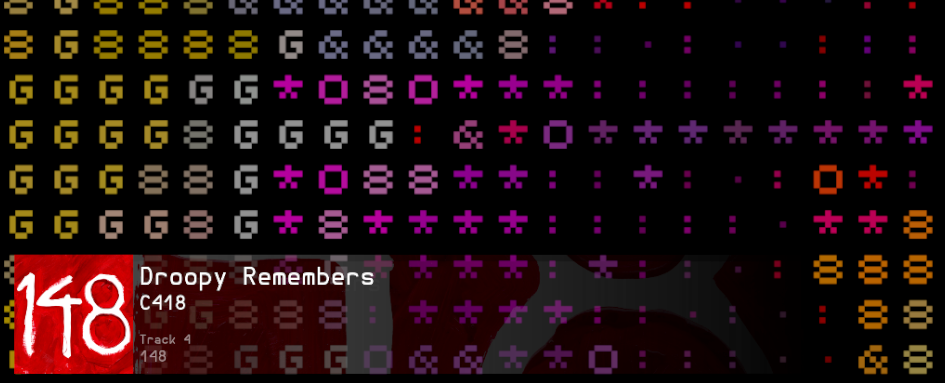

# Subsonic-compatible Now Playing OBS Widget

a small web OBS browser source that displays the song you're jamming to on any Subsonic API compatible server

## Compatibility

- Navidrome ✅

## Installing

### First-time install

- install [bun](https://bun.sh/) (recommended and supported) or [node](https://nodejs.org) (unsupported, should work)
- clone the repository or download the project zip
- run `bun install`

### Starting

- run `bun run dev`

## OBS setup

- create a new browser source
- set its size to something along the lines of 2000x300
  - height defines the size of the text and of the cover
  - width defines the size of the backdrop
- set url to `http://localhost:5173/?url=<url>&user=<user>&pass=<pass>`
  - `url` should be the url of your server, for instance `https://demo.navidrome.org`
    - make sure this has no end slashes!
  - `user` is your username, for instance `demo`
  - `pass` is your password, for instance `demo`
    - note: this password is never sent online as the token auth is used on the Subsonic API
  - for instance, `http://localhost:5173/?url=https://demo.navidrome.org&user=demo&pass=demo`

## visual configuration

you can edit the basic colors in `config.css`
